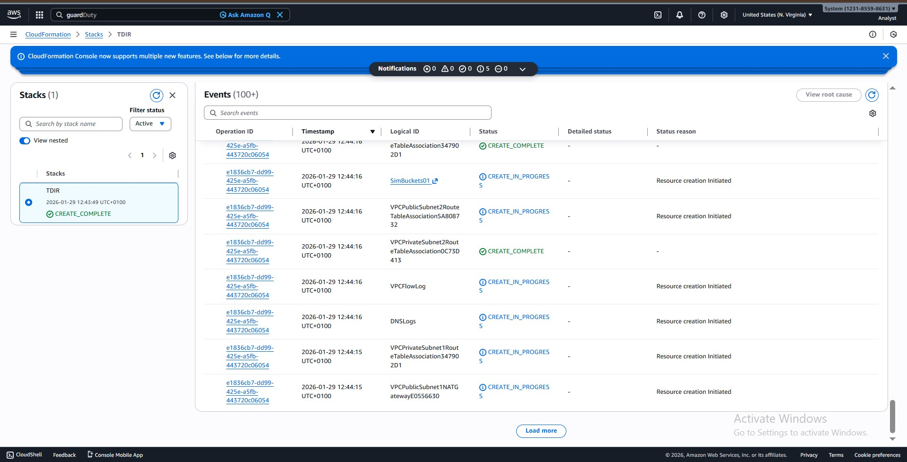
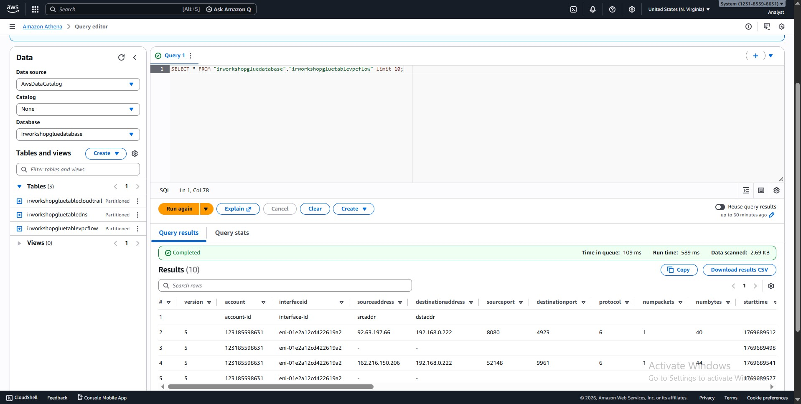
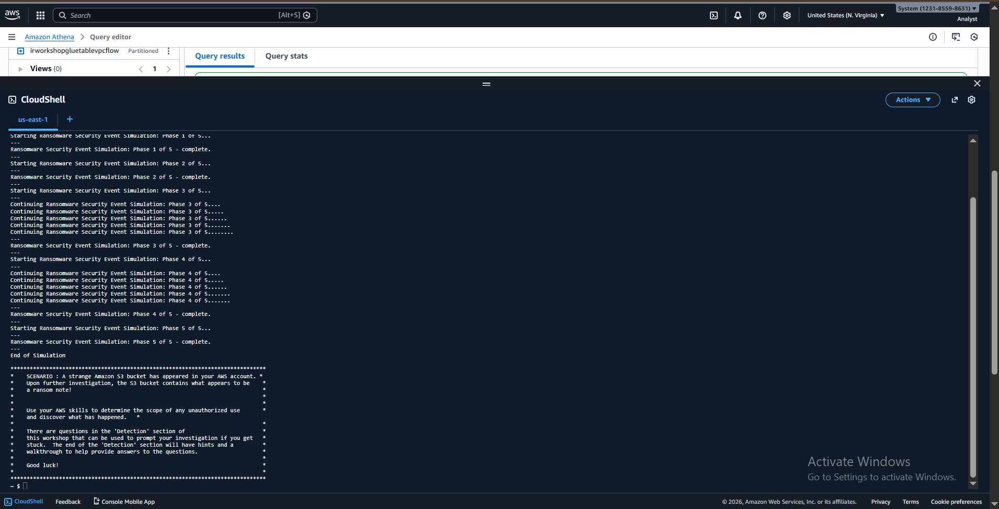
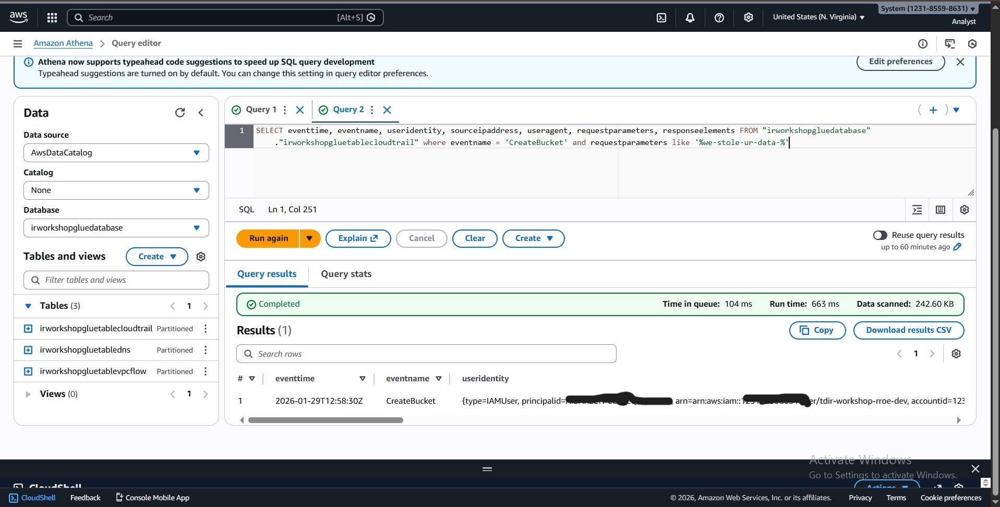
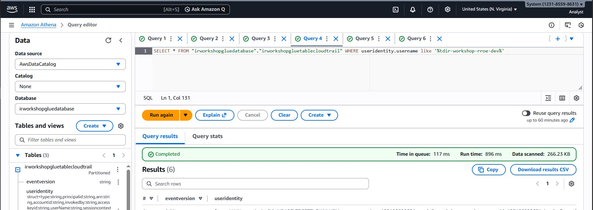
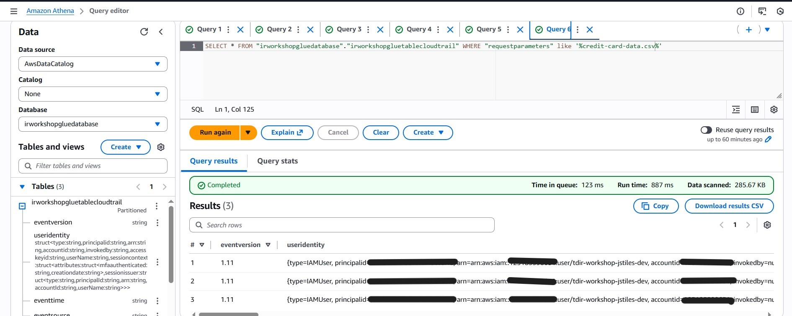
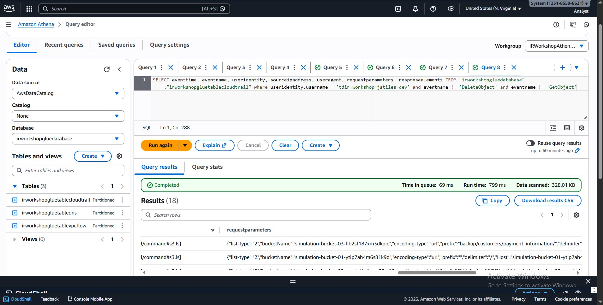

# RANSOMWRE ON S3 - SIMULATION AND DETECTION

AWS CIRT Workshop | Cloud Incident Response | Amazon S3

## INTRODUCTION

This repository documents my participation in an AWS Customer Incident Response Team (CIRT) workshop focused on simulating and detecting a ransomware attack targeting Amazon S3.

The workshop involved both attack simulation and incident response investigation, using AWS-native services and open-source tools to identify evidence of data exfiltration, data destruction, encryption, and logging tampering.

---

## OVERVIEW

In this hands-on lab, I replicated a compromised AWS environment using a CloudFormation template that created multiple IAM users and Amazon S3 buckets. I then used AWS CloudShell to execute a bash script that simulated ransomware-style activity.

Following the simulation, I investigated the incident using logs and analytics tools commonly used by the AWS CIRT team to identify unauthorized activity and reconstruct the attack timeline.

---

## OBJECTIVES

- Simulate ransomware-style activity in an AWS environment
- Detect unauthorized access to Amazon S3
- Investigate data exfiltration and data deletion events
- Understand AWS CIRT investigation workflows
- Answer real-world incident response questions using log evidence

---

## TOOLS AND SERVICES USED

- AWS CloudFormation
- Amazon S3
- AWS CloudShell
- AWS CloudTrail
- Amazon Athena (SQL)
- Linux command-line tools

---

## LAB ENVIRONMENT SETUP

I deployed the lab environment using a provided CloudFormation template. The environment included:

- Multiple IAM users
- Multiple Amazon S3 buckets
- Logging and analytics infrastructure for investigation

---

## RANSOMWARE SIMULATION

Using AWS CloudShell, I executed a bash script that simulated activities commonly observed during ransomware incidents handled by AWS CIRT, including:

- Unauthorized access to S3 objects
- Data exfiltration from an S3 bucket
- Deletion of sensitive objects
- Encryption of objects using Server-Side Encryption with Customer-Provided Keys (SSE-C)

---

## Investigation and Detection

I investigated the incident by analyzing CloudTrail and S3-related logs, correlating IAM activity, IP addresses, user agents, and timestamps to reconstruct the attacker’s actions.

### Incident Response Questions Addressed

- What is the name of the IAM user that created the S3 bucket, and when was it created?
- Was the IAM user that created the bucket the same IAM user that uploaded the ransom note?
- In which bucket and prefix was the object **credit-card-data.csv** stored?
- Was the object exfiltrated, and if so, at what date and time?
- Was **credit-card-data.csv** deleted?
- What IP address and user agent were used to perform the unauthorized activity?
- What IAM user was responsible for the data exfiltration?
- Was this IAM user used to access or exfiltrate other objects?
- What other activities were performed using this IAM user?
- Were any S3 buckets deleted?
- Were objects taken from other buckets?
- How many bytes were deleted from the affected bucket?
- How many bytes were transferred out of the AWS account?
- Server Access Logging was disabled:
  - Which IAM user disabled it?
  - When was it disabled?
  - What API call was used?

---

## Detection Methodology

- Queried CloudTrail logs using Amazon Athena
- Tracked IAM activity across AWS services
- Correlated timestamps to reconstruct the attack timeline
- Identified indicators of compromise such as suspicious IPs and user agents
- Verified data exfiltration and deletion through S3 API events

This approach mirrors the structured investigation workflow used by AWS CIRT.

Below are the queries used in this detection

---

## Key Takeaways

- Ransomware activity in AWS leaves strong forensic evidence when logging is enabled
- IAM credential misuse is a common attack vector
- Disabling logging is a critical indicator of compromise
- A structured, question-driven approach is effective for incident response

---

## Skills Demonstrated

- Cloud Incident Response
- AWS CloudTrail and S3 forensic analysis
- IAM activity investigation
- Log analysis using Amazon Athena (SQL)
- Ransomware detection techniques

---

## Conclusion

This workshop strengthened my hands-on experience with **AWS cloud incident response**, particularly ransomware scenarios involving Amazon S3. It closely reflects real-world AWS CIRT investigations and reinforced the importance of logging, visibility, and structured analysis in cloud security.

---

**Note:** The lab environment and simulation scripts were provided as part of the AWS CIRT workshop. This repository documents the investigation process and learning outcomes.
